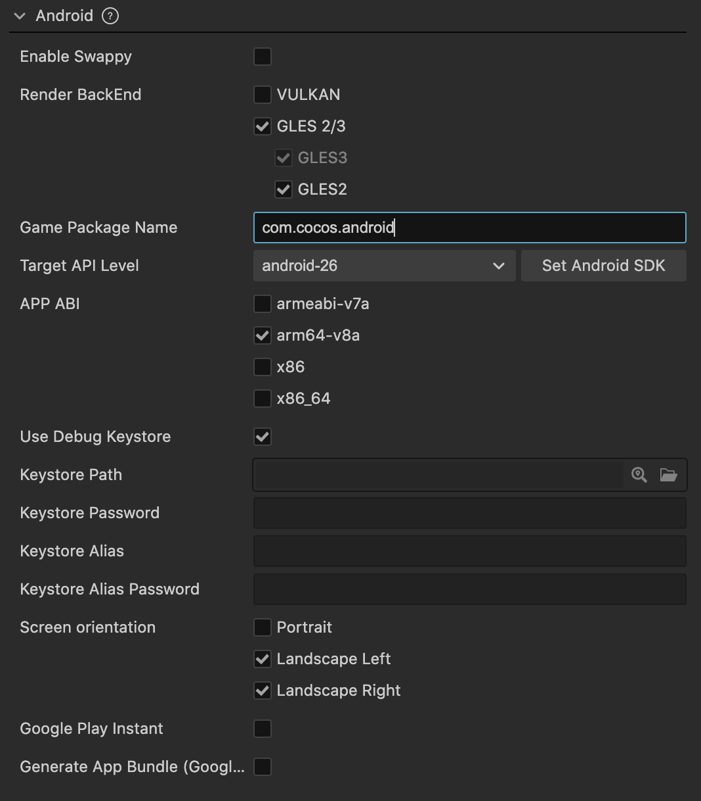

# Build Options - Android

The build options for the Android platform are as follows:

## Enable Swappy

**Enable Swappy** is used to decide whether to enable the integrated Swappy feature in the engine. Currently supported for GLES and Vulkan.

This option actively adjusts the rendering time to match the screen refresh rate, achieving stable frame rates and reducing unnecessary rendering. The build parameter is `swappy`.

For more information, refer to the official documentation on [Frame Pacing Library Overview](https://source.android.com/devices/graphics/frame-pacing)。

## Render Backend

Currently supported options are as follows:
- [VULKAN](https://www.vulkan.org/)
- [GLES3](https://www.khronos.org/registry/OpenGL-Refpages/es3/)
- [GLES2](https://www.khronos.org/registry/OpenGL-Refpages/es2.0/)

At least one option must be selected, with **GLES3** being the default.

If GLES 2/3 is selected, GLES3 must be checked by default and it is not allowed to select GLES2 alone.

When multiple options are selected, the runtime will choose the rendering backend based on the device's actual support.

## Game Package Name

The Game Package Name usually follows the reverse order of the product's website URL, such as `com.mycompany.myproduct`.

> **Note:** The package name can only contain numbers, letters, and underscores. Additionally, the last part of the package name must start with a letter and cannot start with an underscore or a number.

## Target API Level

Set the Target API Level required for Android platform compilation. Clicking the Set Android SDK button next to it will quickly navigate to the configuration page. For specific configuration rules, refer to [Android Development Environment Setup](./build-setup-evn-android.md).

## APP ABI

Set the CPU types that your Android app needs to support. You can choose one or more options, including `armeabi-v7a`, `arm64-v8a`, `x86`, and `x86_64`.

**Note:**

1. When you select one ABI and build it without cleaning, both ABIs' shared objects (so) will be packaged into the APK. This is the default behavior of Android Studio. If you import the project into Android Studio, after building one ABI, perform **Build -> Clean Project** before building another ABI. This way, only the latter ABI will be packaged into the APK

2. After importing the project into Android Studio, it exists independently and is not dependent on the build and release panel. If you need to modify the ABI, directly modify the **PROP_APP_ABI** property in the `gradle.properties` file.

## Use Debug Keystore

Android requires that all APKs be digitally signed with a certificate before they can be installed. Cocos Creator provides a default keystore, and checking **Use Debug Keystore** means using the default keystore. If developers need a custom keystore, uncheck **Use Debug Keystore**. For more details, refer to the [Android Developer - App Signing](https://developer.android.google.cn/studio/publish/app-signing)。

## Orientation

The screen orientation currently includes three options: **Portrait**, **Landscape Left**, and **Landscape Right**.

- **Portrait:** The screen is in an upright position with the Home button at the bottom.
- **Landscape Left:** The screen is in a landscape position with the Home button on the left side of the screen.
- **Landscape Right:** The screen is in a landscape position with the Home button on the right side of the screen.

## Google Play Instant

Checking this option allows you to package and publish your game to Google Play Instant. Google Play Instant is dependent on Google Play and is not a separate distribution channel but rather a game streaming solution. It enables players to try, share, and engage with your game instantly without the need to install it.

**Note the following points when using Google Play Instant:**
1. Android Studio version should be 4.0 or above.
2. Android phones running Android 6.0 or above. Devices with Android SDK versions between 6.0 and 7.0 require the installation of Google Play Services Framework, while devices with SDK versions 8.0 or above do not require it and can use the services directly.
3. For the first build, you need to open the built project with Android Studio to download the Google Play Instant Development SDK (Windows) or Instant Apps Development SDK (Mac) support package. If the download fails, it is recommended to set up an HTTP proxy for Android Studio.

## Generate App Bundle（Google Play）

Checking this option allows you to package your game as an App Bundle format for uploading to the Google Play Store. For more information, refer to the [Android Developer - App Bundle](https://developer.android.google.cn/guide/app-bundle/)。
