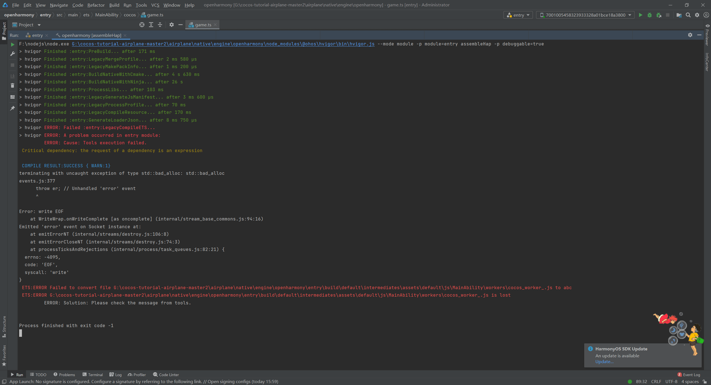

# 发布到 HarmonyOS Next 应用

自 Cocos Creator v2.4.14 起，支持发布到 **HarmonyOS Next** 平台。

## 安装 DevEco Studio

1. 下载最新的 IDE（版本>=5.x）：[DevEco Studio](https://developer.huawei.com/consumer/cn/deveco-studio/)

     <br>

2. 解压目录，双击进行安装，点击 Next，如下步骤：

     <br>
     <br>
     <br>
     <br>
     <br>
     <br>

3. 启动 DevEco Studio，如下图：

     <br>

4. 首次会提示设置源，默认应该就可以，如下图：

     <br>

5. 首次安装需要安装 Node.js，如果之前安装有 Node.js，选择本地的 Node.js 即可，但是有版本要求，Node.js 的版本必须大于 v14.19.1 和小于 v15.0.0。npm 的版本要求大于 6.14.16 和小于 7.0.0。如下图：

     <br>

6. 这里选择下载新的 Node.js 为例，如下图：

     <br>
     <br>

7. 接下来会提示安装 SDK，点击下一步，如下图：

     <br>
     <br>

8. 选择 Accept 之后，选择 Next，等待下载完成，之后点击 Finish 即可，如下图：

     <br>
     <br>


## 发布流程

1. 在 **构建发布** 面板的 **发布平台** 中选择 **HarmonyOS Next**，

     <br>

2. 选择 JavaScript 引擎，目前支持V8、Ark、JSVM，如下图：

     <br>

    > **注意**：在当前平台使用 V8 作为 JavaScript 引擎暂时无法使用 JIT 优化，建议选择使用 JSVM 获得最优的游戏性能。

3. 点击 **构建** 按钮构建项目。

4. 使用 DevEcoStudio，打开工程，如下图：

     <br>

     <br>

5. 配置签名，如下图：

     <br>

6. 插入设备，点击运行，如下图：

     <br>

7. 执行成功之后，在设备上查看效果。

## 几个注意事项

另外，因为 HarmonyOS Next 还在不断完善当中，因此有些已知问题。这些问题都会在后续的版本解决。

- ARK不支持Restart，JSVM与V8是支持的。
- 编译失败时，可能是内存不足导致，退出部分应用，重新 build 试试；
    >>
    >> 
- 更新IDE，编译报错,如下图：
   >> 
- Mac 版 IDE 编译报错，报错信息为:

    ```
    npm ERR! Your cache folder contains root-owned files, due to a bug in
    npm ERR! previous versions of npm which has since been addressed.
    ```

    解决方法:

        在设备终端中执行命令 `sudo chown -R 502:20 "/Users/修改为你的设备用户名/.npm"`，之后重新编译项目
