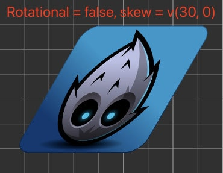

# UISkew Component Reference

The UI Skew component is used to control the skew transformation of UI elements. You can achieve different visual effects by setting the skew angles in both horizontal and vertical directions.

Click the **Add Component** button below the **Inspector** panel and select **UI/UISkew** to add the UISkew component to a node.

For UISkew scripting interface reference, please see [UISkew API](%__APIDOC__%/en/class/UISkew).

## UISkew Properties

| Property | Description |
| :-------------- | :----------- |
| rotational | Whether to use rotation-based skew algorithm
| skewX | Horizontal skew angle (in degrees)
| skewY | Vertical skew angle (in degrees)

---

## UISkew Component Examples




### Modifying Skew Angles through Script

```ts
import { _decorator, Component, Node, UISkew } from 'cc';
const { ccclass, property } = _decorator;

@ccclass('Example')
export class Example extends Component {

    start () {
        const uiSkew = this.getComponent(UISkew);
        if (uiSkew) {
            // Method 1
            uiSkew.setSkew(new Vec2(30, 15));

            // Method 2
            uiSkew.x = 30;
            uiSkew.y = 15;
        }
    }
}
```

### Notes

1. The node's skew transformation affects the rendering of child nodes but does not change the node's size properties
2. When a node undergoes skew transformation, it emits a `'transform-changed'` event, which can be used to monitor node transformations
3. The skew transformation process involves multiple trigonometric calculations; frequent skew transformations will increase game performance overhead